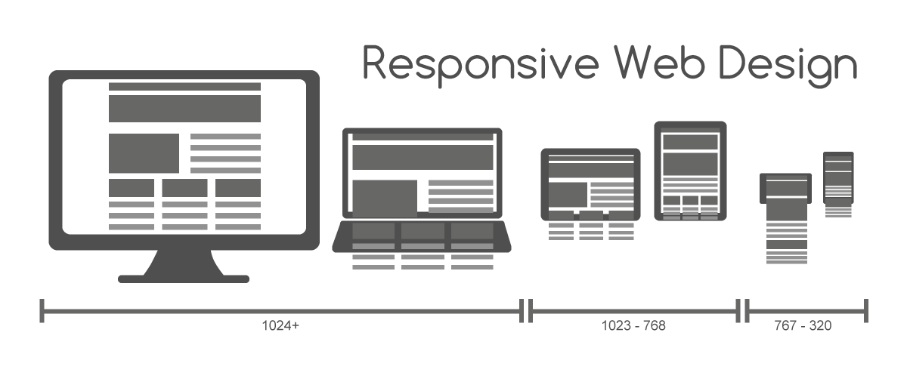

class: title, smokescreen, shelf, no-footer
background-image: url(seo-2078785_1920.png)

# Responsive Design
## September 16, 2019

---

class: title
background-image: url(seo-2078785_1920.png)

---
class: compact
# What is responsive design?

* A web design strategy that strives to optimize the viewing experience across a range of devices, from desktop computers to tablets to mobile phones and smart watches.<br><br>
* What does "optimize" mean?<br><br>
    * For _reading_: font sized properly for device; optimal line length; minimal scrolling/panning/zooming
    * For _mobile data_:  Images properly sized and scaled  (e.g. don't need a 20MP image for a mobile device screen); minimize bandwidth use
    * For _interaction_: properly sized buttons and accessible form elements

---

# Responsive Design



---
class: roomy
# An Ecosystem of Design Strategies

* Elegant Degradation (Desktop First)<br><br>

* Progressive Enhancement (Mobile First)<br><br>

_Responsive design can be applied in either strategy._

---
class: compact
# Setting the Viewport

As a foundation for responsive web design, always include the following HTML inside your `<head>` element:

```html
<meta name="viewport" content="width=device-width, initial-scale=1">
```


---


---

class: col-3

# Responsive vs Adaptive vs Fluid

* Responsive - uses @media queries<br><br><br><br>
* Adaptive - uses a constrained set of @media queries to design for specific breakpoints
* Fluid - uses percentage width and similar relative sizing

---

@media Queries

https://www.fastcompany.com/3038367/9-gifs-that-explain-responsive-design-brilliantly-2
