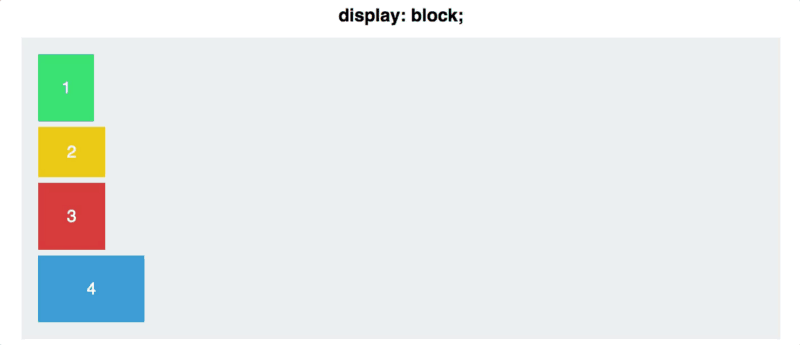
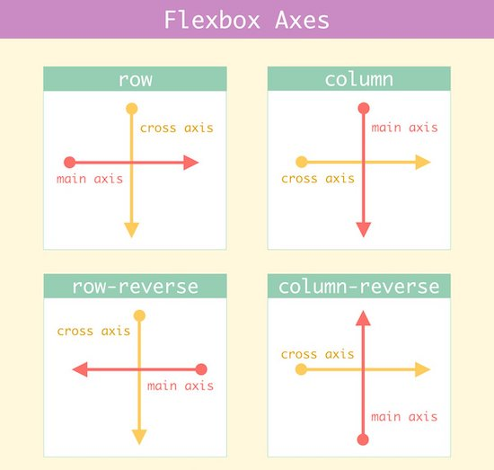

class: title, smokescreen, shelf, no-footer
background-image: url(flex-direction.svg)

# Flexbox
## September 23, 2019

---

# Flexbox vs. Grid

--
* Use **Flexbox** for layout of items in a single dimension:  in **a** row or **a** column.


--
* Use **Grid** for layout of items in two dimensions: in rows **and** columns.


--
* &uarr; &uarr; &uarr; These are more suggestions than rules.


--
* **Flexbox** and **Grid** can work together: a grid item can be a flexbox container. A flex item can be a grid container.

---
class: title
# [http://bit.ly/2019-09-23www](http://bit.ly/2019-09-23www)

---
class: center
# Block vs Flexbox

```css
display: flex;
```

<br>
<small>[How Flexbox works — explained with big, colorful, animated gifs](https://www.freecodecamp.org/news/an-animated-guide-to-flexbox-d280cf6afc35/)</small>
---
class: title

# Let's code...
## [http://bit.ly/2019-09-23www](http://bit.ly/2019-09-23www)
---

class: center


---

