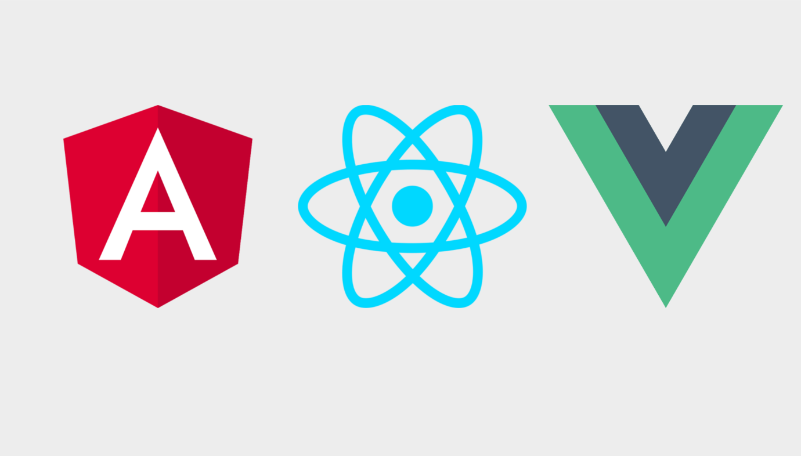

# Prof. Olson's Final Project Open Office Hours

* [https://calendly.com/mark-olson](https://calendly.com/mark-olson)
* Monday, December 9, 8 AM - 10 AM / 2 - 4 PM
* Tuesday, December 10, 8 AM - 10 AM, Noon - 2 PM, 3 - 4 PM
* Piazza!!!

---
class: title
# Course Evals

---

class: title smokescreen shelf no-footer compact
background-image: url(https://cdn.elearningindustry.com/wp-content/uploads/2018/08/what-is-the-future-of-web-scraping-for-android-apps-1024x574.jpg)

# The Future Web:
## Frameworks, Web Assembly, Pyodide, WebXR December 2, 2019

---

# Some CSS Frameworks

* [Bootstrap](https://getbootstrap.com/)  
* [Bulma](https://bulma.io/)  
* [UIKit](https://getuikit.com/)  
* [SemanticUI](https://semantic-ui.com/)  
* [MaterializeCSS](https://materializecss.com/)

---
class: img-caption

### Javascript Frameworks React vs. Angular vs. Vue

???

React - Facebook, originally released in 2013; uses JSX, an HTML-like syntax; moderate learning curve

Angular - developed by Google, was first released in 2010, uses Typescript; v2 - 2016; steepest learning curve

Vue - ex-Google employee; tiny size; small but growing; easiest to learn but can get by with terrible code, making debugging and testing difficult

---
class: roomy
# Javascript Frameworks

* Develop across platforms - web, mobile web, mobile &amp; desktop native  
* Component-based (re-usable; only update/render parts of a webpage)

---
class: center compact

# Web Assembly (Wasm)

   
[https://webassembly.org/](https://webassembly.org/)   

--
[https://emscripten.org/](https://emscripten.org/)

???

WebAssembly (abbreviated Wasm) is a new type of code that can be run in modern web browsers — it is a low-level assembly-like language with a compact binary format that runs with near-native performance and provides languages such as C/C++ and Rust with a compilation target so that they can run on the web. It is also designed to run alongside JavaScript, allowing both to work together.

WebAssembly is designed to complement and run alongside JavaScript — using the WebAssembly JavaScript APIs, you can load WebAssembly modules into a JavaScript app and share functionality between the two. This allows you to take advantage of WebAssembly's performance and power and JavaScript's expressiveness and flexibility in the same apps, even if you don't know how to write WebAssembly code.

Compiler for C/C++:  Emscripten

---
class: title
# Web Assembly Example

### [OpenCV.js](https://docs.opencv.org/master/df/d0a/tutorial_js_intro.html)  [https://codepen.io/huningxin/pen/NvjdeN](https://codepen.io/huningxin/pen/NvjdeN)

--- 

# Python in the Browser

* Pyodide - [https://github.com/iodide-project/pyodide](https://github.com/iodide-project/pyodide)
* Streamlit - [https://streamlit.io/](https://streamlit.io/)

---

# WebXR

---

# Final Project Submission

No later than noon (12 PM) on December 11

Send an email to your lab instructor and Prof. Olson with the following:

* Subject line:  Your last name, first name Final Web Project
* Body of email:  
    * URL to your final project
    * One-page site self-assessment / post-mortem reflection *in the body of the email*
    * Confirmation that you have completed the anonymous course evaluation.  
